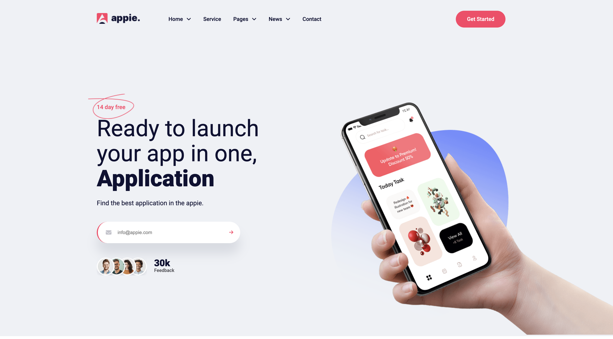

<h1 align="center">Appie App Landing Page</h1>

      A modern and responsive landing page design for showcasing the features and benefits of the Appie App.

  <h3>
    <a href="https://ahmedsmaha.github.io/Appie-App">
      Demo
    </a>
  </h3>

## Table of Contents

- [Overview](#overview)
  - [What I learned](#what-i-learned)
  - [Useful resources](#useful-resources)
- [Built with](#built-with)
- [Features](#features)
- [Contact](#contact)
- [Acknowledgements](#acknowledgements)

## Overview

The **Appie App Landing Page** was created to showcase the main features and benefits of an app. This page focuses on clean design, responsiveness, and clear call-to-action sections.

### What I learned

- How to structure semantic HTML for a landing page.
- Advanced CSS techniques for layout design using:
  - **Flexbox** for section alignment.
  - **Grid** for responsive designs.
- Best practices for a visually appealing and user-friendly design.

### Useful resources

- [CSS Tricks - Flexbox Guide](https://css-tricks.com/snippets/css/a-guide-to-flexbox/) - This guide helped me understand Flexbox properties in-depth.
- [MDN Web Docs - CSS Grid](https://developer.mozilla.org/en-US/docs/Web/CSS/CSS_Grid_Layout) - A great resource for learning CSS Grid.

### Built with

- Semantic HTML5 markup
- CSS custom properties
- Flexbox
- CSS Grid

## Features

- **Responsive Design**: Adapts to different screen sizes.
- **Smooth Scroll**: Easy navigation between sections.
- **Call-to-Action Sections**: Encourages users to download the app or sign up.

## Acknowledgements

- [Font Awesome](https://fontawesome.com/) - Used for app-related icons.
- [Google Fonts](https://fonts.google.com/) - Typography for the landing page.

## Author

- Website [ahmedsmaha.github.io/ahmedsmaha](https://ahmedsmaha.github.io/ahmedsmaha)
- GitHub [@ahmedsmaha](https://github.com/ahmedsmaha)
